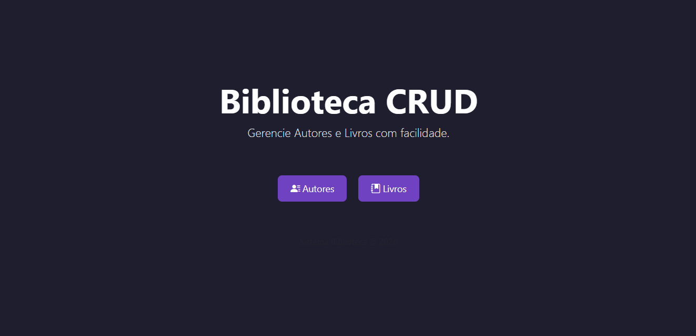

# 📚 Sistema Biblioteca – Gerenciamento de Livros e Autores




Sistema web para **gerenciamento de biblioteca**, permitindo o cadastro, edição, listagem e exclusão de **livros e autores**.  
O projeto utiliza **Java (Servlets)** no backend, **MySQL** como banco de dados e **HTML + Bootstrap + JavaScript** no frontend, com foco em uma interface moderna no estilo **dashboard**.

---

## 📑 Sumário

- [🧑‍💻 Autores](#-autores)
- [🛠️ Tecnologias Utilizadas](#️-tecnologias-utilizadas)
- [📁 Estrutura de Diretórios](#-estrutura-de-diretórios)
- [🗄️ Banco de Dados](#️-banco-de-dados)
- [🖥️ Funcionalidades](#️-funcionalidades)
- [🚀 Como Executar o Projeto](#-como-executar-o-projeto)
- [🎨 Interface e Layout](#-interface-e-layout)
- [🛑 Dificuldades Encontradas](#-dificuldades-encontradas)

---

## 🧑‍💻 Autores

- **[Enzo Santana Magalhães](https://github.com/ES-Magalhaes)**  
  Desenvolvimento Full Stack • QA • Documentação

---

## 🛠️ Tecnologias Utilizadas

### 💻 Linguagens e Frameworks
- Java (Servlets)
- JavaScript (Fetch API)
- HTML5
- CSS3
- Bootstrap 5.3

### 🗄️ Banco de Dados
- MySQL

### 🧰 Ferramentas
- Apache Tomcat
- Git & GitHub
- Eclipse / IntelliJ / VS Code
- MySQL Workbench

---

## 📁 Estrutura de Diretórios

```plaintext
SistemaBiblioteca/
├── database/
│   └── init.sql
├── src/
│   └── main/
│       └── java/
│           └── br/com/biblioteca/
│               ├── controller/
│               ├── dao/
│               ├── model/
│               └── util/
├── webapp/
│   ├── css/
│   │   └── styles.css
│   ├── js/
│   │   ├── autores.js
│   │   └── livros.js
│   ├── autores.html
│   ├── livros.html
│   └── index.html
├── .gitignore
└── README.md
```

## 🗄️ Banco de Dados

O banco de dados é criado utilizando o script init.sql, localizado na pasta database/.

```plaintext
CREATE DATABASE IF NOT EXISTS biblioteca;
USE biblioteca;

CREATE TABLE autores (
    id_autor INT PRIMARY KEY AUTO_INCREMENT,
    nome VARCHAR(100) NOT NULL,
    nacionalidade VARCHAR(50) NOT NULL,
    estilo VARCHAR(100)
);

CREATE TABLE livros (
    id_livro INT PRIMARY KEY AUTO_INCREMENT,
    titulo VARCHAR(100) NOT NULL,
    ano_publicacao INT,
    isbn VARCHAR(20) UNIQUE,
    status ENUM('disponivel', 'emprestado') DEFAULT 'disponivel',
    fk_autor INT,
    FOREIGN KEY (fk_autor) REFERENCES autores(id_autor)
);
```
## 🖥️ Funcionalidades
### 📘 Autores

- Cadastrar autor
- Listar autores
- Editar autor
- Excluir autor

### 📗 Livros

- Cadastrar livro
- Listar livros
- Editar livro
- Excluir livro
- Associação de livro com autor

## 🚀 Como Executar o Projeto
### 1️⃣ Banco de Dados

- Abra o MySQL Workbench
- Execute o script database/init.sql

### 2️⃣ Backend

- Importe o projeto na IDE (Eclipse ou IntelliJ)
- Configure o Apache Tomcat
- Ajuste a conexão com o banco de dados
- Inicie o servidor

### 3️⃣ Frontend

- Acesse pelo navegador:
```plaintext
http://localhost:8080/SistemaBiblioteca/
http://localhost:8080/SistemaBiblioteca/autores.html
http://localhost:8080/SistemaBiblioteca/livros.html
```
## 🎨 Interface e Layout

- Layout no estilo dashboard moderno
- Sidebar fixa com navegação
- Tema escuro com tons de roxo
- Tabelas estilizadas com Bootstrap
- Botões padronizados com ícones (Bootstrap Icons)

## 🛑 Dificuldades Encontradas

Atualização de arquivos no Tomcat exigindo limpeza de cache
Padronização visual entre páginas
Integração frontend (Fetch API) com backend Java
Ajustes de layout com Bootstrap e CSS customizado

---

📌 Projeto desenvolvido para fins acadêmicos e prática de desenvolvimento web full stack.